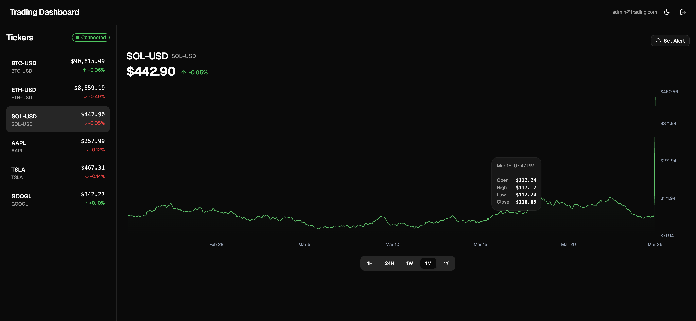
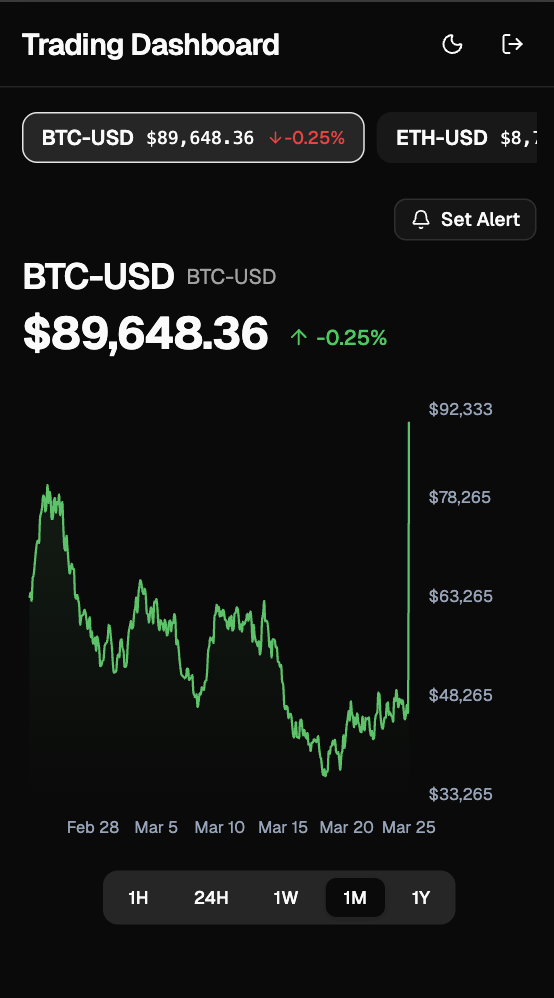
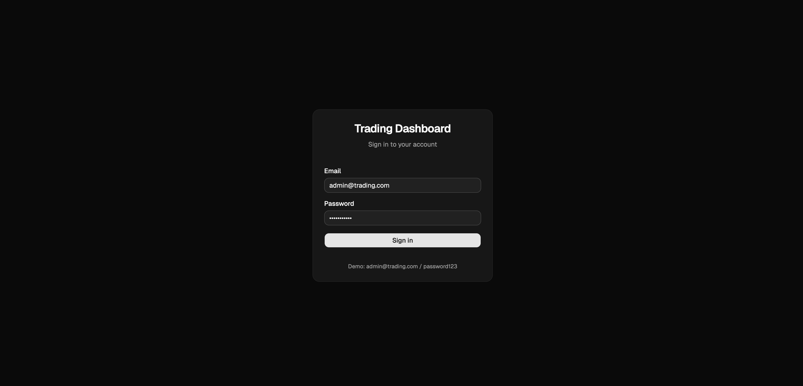

# Real-Time Trading Dashboard

A real-time cryptocurrency and stock trading dashboard with live price streaming, interactive charts, and price alerts. Built with React 19, TypeScript, Node.js, WebSocket, Recharts, and shadcn/ui.

## Screenshots

### Dashboard (Desktop)



### Dashboard (Mobile)



### Login



## Architecture

```
┌─────────────────────────────────────────────────────┐
│                    Frontend                          │
│         React 19 + Vite 6 + TypeScript              │
│  ┌──────────┐  ┌──────────┐  ┌────────────────┐    │
│  │ Dashboard │  │  Charts  │  │  Price Alerts  │    │
│  │ (shadcn)  │  │(Recharts)│  │  (shadcn/ui)   │    │
│  └─────┬─────┘  └─────┬────┘  └───────┬────────┘    │
│        │              │               │              │
│  ┌─────┴──────────────┴───────────────┴─────┐       │
│  │     TanStack Query (Cache + Fetch)        │       │
│  └─────┬──────────────────────────────┬──────┘       │
│        │ REST (fetch)                 │ WebSocket    │
└────────┼──────────────────────────────┼──────────────┘
         │                              │
┌────────┼──────────────────────────────┼──────────────┐
│        ▼           Backend            ▼              │
│  ┌───────────┐              ┌──────────────┐        │
│  │ Express 5  │              │  WS Server   │        │
│  │ REST API   │              │ Live Prices  │        │
│  │ + Auth     │              │ + Alerts     │        │
│  └─────┬──────┘              └──────┬───────┘        │
│        │                            │                │
│  ┌─────┴────────────────────────────┴─────┐         │
│  │  Mock Data Generator (GBM Algorithm)    │         │
│  │  + In-Memory Cache + Response Cache     │         │
│  └─────────────────────────────────────────┘         │
│         Node.js 22 + TypeScript                      │
└──────────────────────────────────────────────────────┘
```

## Tech Stack

### Core

| Layer              | Technology                     | Version                |
| ------------------ | ------------------------------ | ---------------------- |
| Backend Runtime    | Node.js + Express              | Node 22 LTS, Express 5 |
| WebSocket          | ws                             | 8.x                    |
| Backend Testing    | Jest + supertest               | Jest 30, supertest 7   |
| Frontend Testing   | Vitest + React Testing Library | Vitest 3.x, RTL 16.x   |
| Frontend Framework | React + TypeScript             | React 19, TS 5.7       |
| Build Tool         | Vite                           | 6.x                    |
| UI Components      | shadcn/ui + Radix UI           | latest                 |
| Charting           | Recharts                       | 2.x                    |
| State/Cache        | TanStack Query (React Query)   | v5                     |
| URL State          | nuqs                           | latest                 |
| Styling            | Tailwind CSS                   | v4                     |
| Theming            | next-themes                    | latest                 |
| Containerization   | Docker + docker-compose        | latest                 |

### Dev Tooling

| Tool        | Purpose                            |
| ----------- | ---------------------------------- |
| ESLint 9    | Linting (flat config)              |
| Prettier 3  | Code formatting                    |
| Husky 9     | Git hooks (pre-commit, commit-msg) |
| commitlint  | Enforce conventional commits       |
| lint-staged | Run linters on staged files only   |

## Getting Started

### Prerequisites

- Node.js >= 22.12
- npm >= 10
- Docker (optional)

### Environment Variables

Each service has its own `.env` file. Copy the examples to get started:

```bash
cp backend/.env.example backend/.env
cp frontend/.env.example frontend/.env
```

#### Backend (`backend/.env`)

| Variable      | Default                 | Description             |
| ------------- | ----------------------- | ----------------------- |
| `PORT`        | `3075`                  | Server port             |
| `NODE_ENV`    | `development`           | Environment mode        |
| `JWT_SECRET`  | `dev-secret-key`        | JWT signing secret      |
| `CORS_ORIGIN` | `http://localhost:5178` | Allowed frontend origin |

#### Frontend (`frontend/.env`)

| Variable       | Default                 | Description           |
| -------------- | ----------------------- | --------------------- |
| `VITE_API_URL` | `http://localhost:3075` | Backend REST API URL  |
| `VITE_WS_URL`  | `ws://localhost:3075`   | Backend WebSocket URL |

### Run Locally

```bash
# Backend
cd backend
npm install
npm run dev
# Server runs on http://localhost:3075

# Frontend (new terminal)
cd frontend
npm install
npm run dev
# App runs on http://localhost:5178
```

### Run with Docker

```bash
docker-compose up --build
```

### Running Tests

```bash
# Backend (27 tests)
cd backend
npm test

# Frontend (22 tests)
cd frontend
npm test
```

## Project Structure

```
├── backend/
│   ├── src/
│   │   ├── routes/          # REST endpoints (tickers, alerts, auth)
│   │   ├── middleware/      # JWT auth middleware
│   │   ├── services/        # Market data generator, WebSocket, alerts
│   │   └── types/           # Shared TypeScript types
│   └── tests/               # Jest + supertest
├── frontend/
│   ├── src/
│   │   ├── components/      # Feature components + ui/ (shadcn)
│   │   ├── pages/           # LoginPage, DashboardPage
│   │   ├── hooks/           # useWebSocket, useTickers, useAuth, etc.
│   │   ├── services/        # API + auth service layer
│   │   ├── providers/       # Theme, Auth, Query providers
│   │   ├── types/           # Frontend types + auth context
│   │   └── lib/             # Utilities (formatters, cn helper)
│   └── tests/               # Vitest + RTL
├── k8s/                     # Kubernetes manifests
├── docker-compose.yml
└── PLAN.md                  # Development plan
```

## API Reference

### REST Endpoints

| Method | Endpoint                     | Auth | Description            |
| ------ | ---------------------------- | ---- | ---------------------- |
| GET    | /api/health                  | No   | Health check           |
| POST   | /api/auth/login              | No   | Login (returns cookie) |
| POST   | /api/auth/logout             | No   | Logout (clears cookie) |
| GET    | /api/auth/me                 | Yes  | Current user           |
| GET    | /api/tickers                 | Yes  | List all tickers       |
| GET    | /api/tickers/:symbol/history | Yes  | Historical OHLC data   |
| GET    | /api/alerts                  | Yes  | List alerts            |
| POST   | /api/alerts                  | Yes  | Create price alert     |
| DELETE | /api/alerts/:id              | Yes  | Delete alert           |

### WebSocket

```
URL: ws://localhost:3075/ws

// Subscribe
{ "type": "subscribe", "symbol": "BTC-USD" }

// Server sends price updates every ~1s
{ "type": "price_update", "data": { "symbol": "BTC-USD", "price": 64532.12, "change": -63.7, "changePercent": -0.099, "timestamp": 1774293968980 } }

// Server sends alert when threshold crossed
{ "type": "alert_triggered", "alert": { "id": "alert_1", "symbol": "BTC-USD", "targetPrice": 65000, "direction": "above" }, "currentPrice": 65012.34 }
```

## Features

### Core

- Live ticker list with real-time price updates via WebSocket
- Interactive area chart with time range selector (1H, 24H, 1W, 1M, 1Y)
- Ticker switching with client-side data caching (TanStack Query)
- Dark/Light theme toggle (dark default)
- Responsive design — sidebar on desktop, horizontal ticker bar on mobile
- URL state management with nuqs (shareable links)
- WebSocket auto-reconnect with exponential backoff

### Bonus

- **Client-side caching** — TanStack Query with 5min staleTime, automatic deduplication
- **Server-side caching** — Pre-serialized response cache + compression middleware
- **Price threshold alerts** — Full-stack: REST API + WebSocket notification + toast UI
- **Mock JWT authentication** — httpOnly cookie, protected routes, login/logout flow
- **Kubernetes manifests** — Deployment + Service YAML for both services
- **Error handling** — ErrorBoundary, toast notifications, loading skeletons, connection status

## Assumptions & Trade-offs

### Data Generation

- Historical data uses **Geometric Brownian Motion** (GBM) with Gaussian random for realistic price simulation
- Daily candles include **mean reversion** toward base price to prevent extreme drift
- Data is generated **on server startup** and cached in-memory (not persistent across restarts)

### WebSocket

- **Single connection** per client for all tickers (not one per ticker)
- Server broadcasts price updates **every 1 second** to subscribed clients only
- Client reconnects with **exponential backoff** (1s → 2s → 4s → max 30s)

### Authentication

- Mock implementation with **hardcoded credentials** (admin@trading.com / password123)
- JWT stored in **httpOnly cookie** (not localStorage) to prevent XSS attacks
- Same-origin deployment (Docker/K8s): `sameSite: 'strict'` for CSRF protection
- Cross-origin deployment (e.g., Vercel + Render): `sameSite: 'none'` + `secure: true` for cookie to work across domains
- Frontend never accesses the token directly — uses `credentials: 'include'`

### Chart

- Time ranges use different candle intervals: 1H=1min, 24H=5min, 1W=30min, 1M=2hr, 1Y=daily
- Live updates modify the **last candle's close/high/low** (not adding new points)
- X-axis labels adapt automatically based on data time span

### Performance

- `React.memo` on TickerItem — only changed tickers re-render
- `useSyncExternalStore` for media queries (React 19 compatible)
- Response compression (gzip) on all REST endpoints
- Pre-serialized JSON cache to avoid repeated `JSON.stringify`

## Deployment

### Docker

```bash
docker-compose up --build
# Frontend: http://localhost
# Backend: http://localhost:3075
```

### Kubernetes

```bash
kubectl apply -f k8s/
```

## Demo Credentials

```
Email: admin@trading.com
Password: password123
```

## License

MIT
